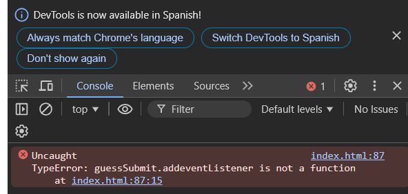
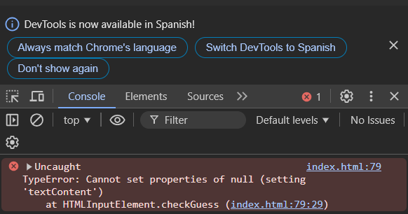
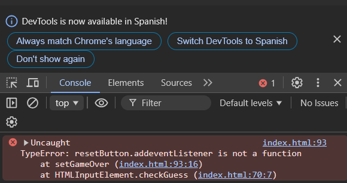
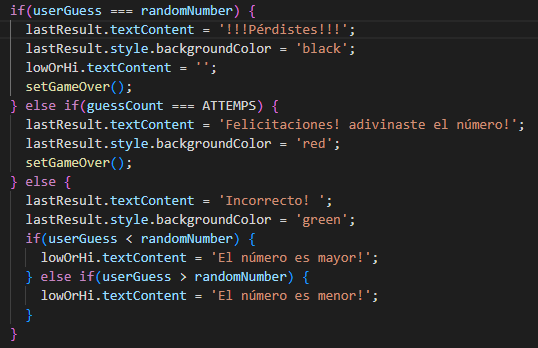
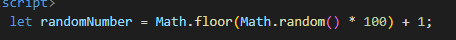

# Problemas encontrados.

Resolviendo los bugs enocntrados en pasos se encontro que.


## Problema No. 1

Se consulto como primer punto la consola del navegador para poder determinar cualera el primer error y se econtro lo siguiente. 


TypeError: guessSubmit.addeventListener is not a function at index.html:87:15

Por lo que se considera que en la linea 87 la funcion esta siendo mal llamada (esta mal escrito los nombres de las funciones) "addeventListener" debe ser "addEventListener".

## Problema No. 2


No detecta ningun elemento, esto debe por el mal uso del lowOrHi y su metodo .testContent y esto pasa porque no se selecciono bien el elemento por lo tanto se corrige de la siguiente forma 
"const lowOrHi = document.querySelector('.lowOrHi');"

## Problema No. 3


Mismo problema ya que el metodo esta siento mal llamado con el evento "addEventListener"

## Problema No. 4


Se corrigio el metodo donde se compara para poder ver quien es el ganador y quien es el perdedor. 

```bash
  if(userGuess === randomNumber) {
      lastResult.textContent = 'Felicitaciones! adivinaste el número!';
      lastResult.style.backgroundColor = 'black';
      lowOrHi.textContent = '';
      setGameOver();
    } else if(guessCount === ATTEMPS) {
      lastResult.textContent = '!!!Pérdistes!!!';
      lastResult.style.backgroundColor = 'red';
      setGameOver();
    }
```

## Problema No. 5


Se reviso el codigo y la parte de la generación de los numeros rambdom se genera mal por lo que se corrigio con este codigo 

```javascript
let randomNumber = Math.floor(Math.random() * 100) + 1;
```
y tambien aqui 
```javascript
randomNumber = Math.floor(Math.random() * 100) + 1;
```


## Problema No. 6
Se corrigio la linea de codigo 44 ya que tenia esto.

```javascript
const ATTEMPS = 5;
```
y esto solo me daba 5 intentos de poder colocar un numero, esto se remplazo por esto 

```javascript
const ATTEMPS = 10;
```

## Problema No. 7
Se corrigio el color del mensaje cuando el usuario ingresa un numero malo 

```javascript
lastResult.style.backgroundColor = 'black';
```

## Problema No. 8

Se agrego la parte de la validación para que solo ingresen numeros enteros y de lo contrario muestre una alerta.

```javascript

let userGuess = Number(guessField.value);

if (!Number.isInteger(userGuess) || userGuess < 1 || userGuess > 100) {
      alert('Por favor, ingresa un número entero entre 1 y 100.');
      guessField.value = '';
      guessField.focus();
      return;
    }
```


## Creado
Esta solución fue creada por:

- Rivaldo Alexander Tojín Ixcotoyac

